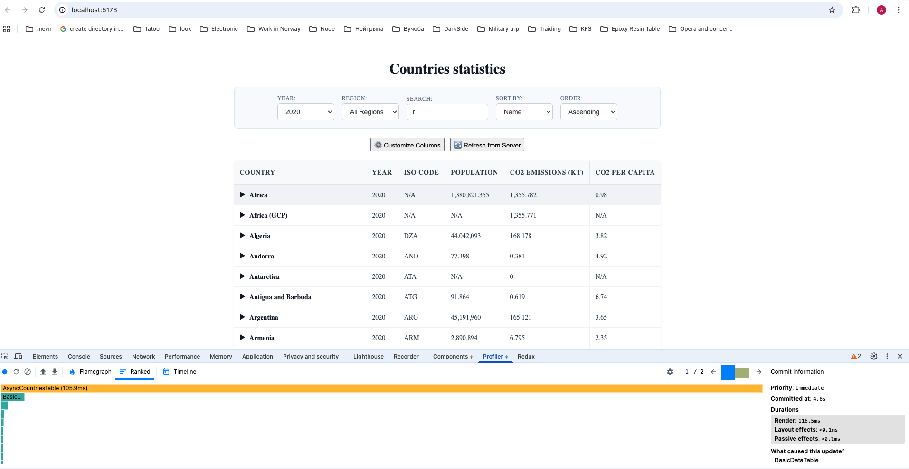
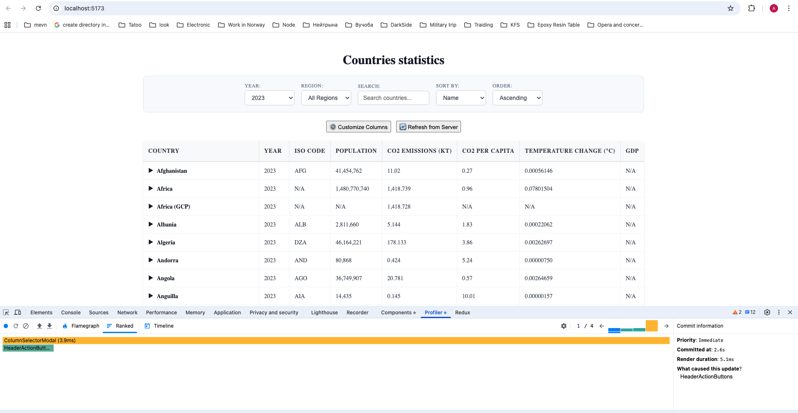
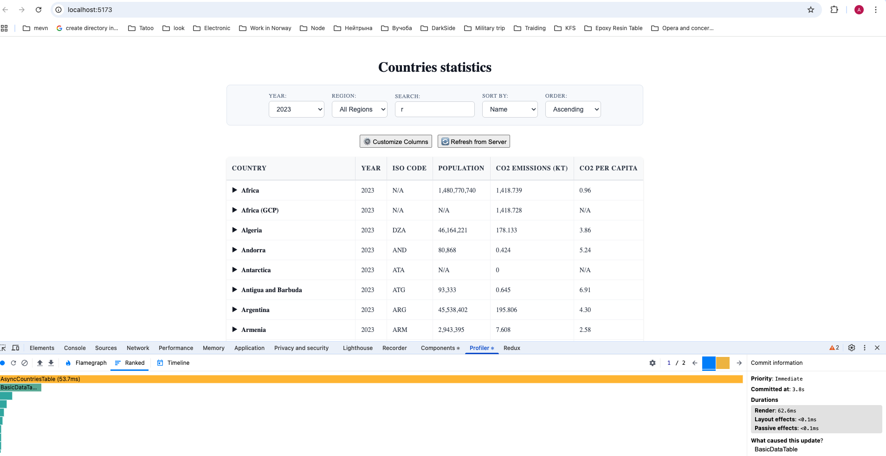
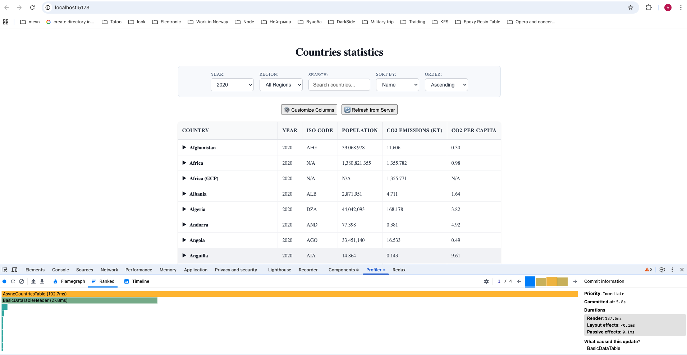
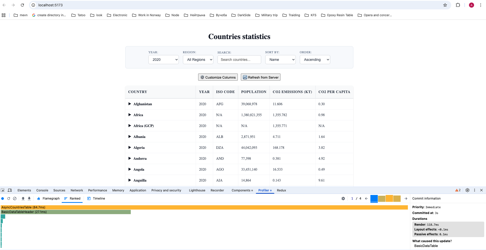
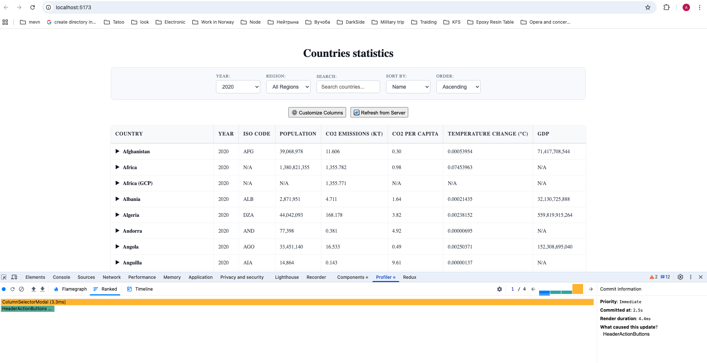
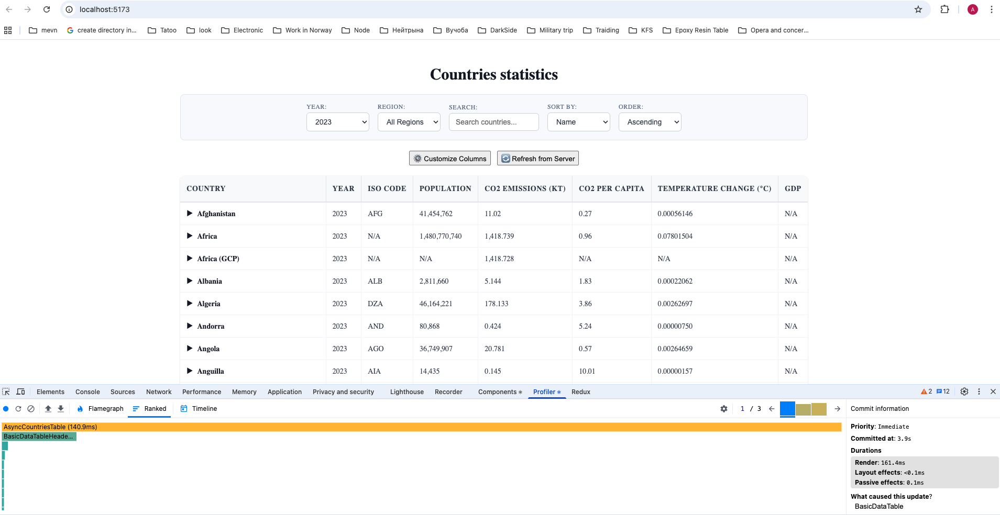
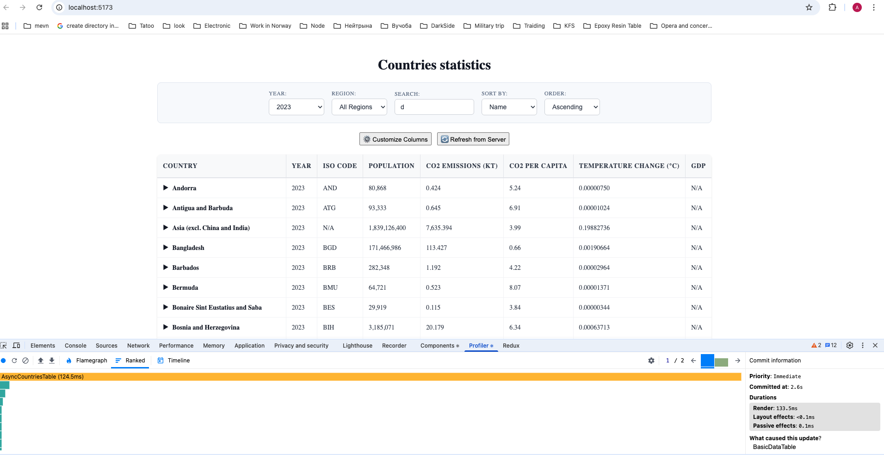

# React Performance Optimization

RSSchool course React 2025 Q3

## Before Optimization

_Performance issues when sorting countries_

_Re-rendering issues when adding columns_

_Expensive calculations on year change_

_Unnecessary re-renders during country selection_

## After Optimization

_Improved performance when sorting countries_

_Optimized re-rendering when adding columns_

_Optimized calculations on year change_

_Reduced re-renders during country selection_
